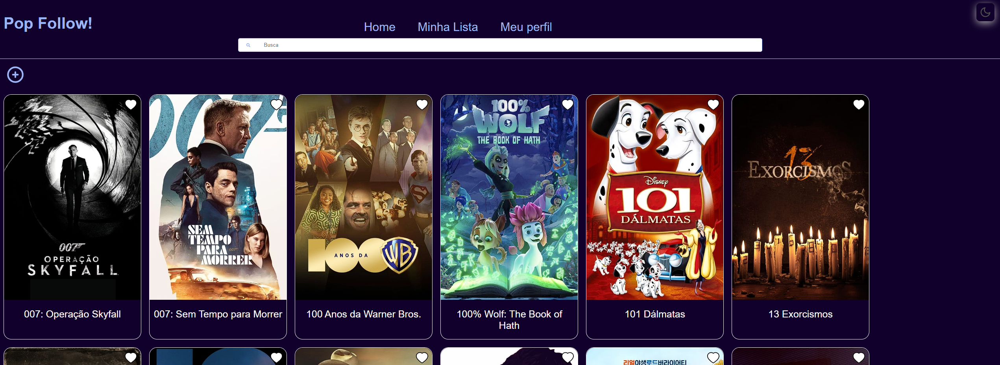
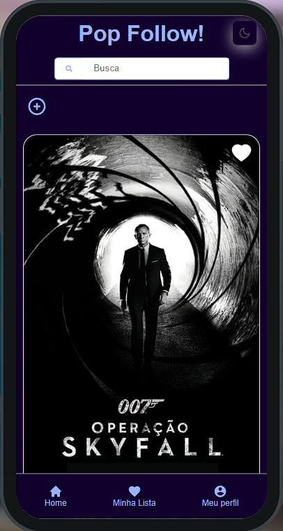

# Pop Follow Client

Este é o Front end construído em JavaScript, com o framework React. Ele foi projetado para o usuário favoritar seu título de entreterimento favorito e marcar depois se já o viu ou quais episodeos já viu.

# Funcionalidades 

- Catálogo de títulos disponíveis para os usuários (Usando a API do TMDB)
- Possibilidade de favoritar títulos e marcar como assistidos
- Adicionar novos títulos ao catálogo, incluindo informações como nome, gênero e sinopse
- Troca de tema entre claro e escuro
- Barra de pesquisa funcional

## Licença

[](https://choosealicense.com/licenses/mit/)

## Autores

- [@OtavioCleyderman](https://github.com/OtavioCleyderman)

# Estrutura e stack utilizada

**Stack:** React com JavaScript, SASS, Axios, JWT...

**Estrutura do projeto:**

```shell
$ popfollow-client/
├── .github
├── public/
│   └── styles/
├── src/
│   └── assets/
│      └── avatares/
│        ├── boys
│        ├── girls
│        └── others
│      ├── ico/
│      ├── popfollow.ico
│      ├── google.png
│      ├── popfollow.png
│      └── titlesApi.js
│   └── components/
│      └── ButtonCreate/
│        ├── ButtonCreate.jsx
│        └── buttonCreate.scss
│      └── Cards/
│        └── Cards.jsx
│      └── Header/
│        ├── Header.jsx
│        └── header.scss
│      └── Loader/
│        ├── Loader.jsx
│        └── loader.scss
│      └── Logo/
│        ├── Logo.jsx
│        └── logo.scss
│      └── Modal/
│        ├── Modal.jsx
│        └── modal.scss
│      └── Nav/
│        ├── Nav.jsx
│        └── nav.scss
│      └── SearchBar/
│        ├── SearchBar.jsx
│        └── searchBar.scss
│      └── ToggleTheme/
│        ├── ToggleTheme.jsx
│        └── toggleTheme.scss
│   └── pages/
│      └── Account/
│        ├── Account.jsx
│        └── account.scss
│      └── Auth/
│        ├── SignIn.jsx
│        ├── SignUp.jsx
│        └── styles.scss
│      └── Details/
│        ├──Details.jsx
│        └── details.scss
│      └── Favorites/
│        ├──Favorites.jsx
│        └── favorites.scss
│      └── Home/
│        ├──Home.jsx
│        └── home.scss
│   └── styles/
│      ├── main.scss
│      ├── theme.scss
│      └── variables.scss
│    ├── App.jsx
│    ├── AuthContext.jsx
│    ├── ProtectedRoute.jsx
│    ├── ThemeProvider.jsx
│    ├── main.jsx
│    └── routes.jsx
├── .eslintrc.cjs
├── .gitignore
├── index.html
├── package-lock.json
├── package.json
├── vercel.json
└── vite.config.js
```

## Demonstração

Projeto rodando na bohr.io, a primeira plataforma serverless brasileira, vale a pena conferir: https://popfollow.bohr.io/

Projeto rodando na vercel: https://popfollow.vercel.app/

### Prévia layout Desktop


### Prévia layout Mobile


## Para rodar o projeto em sua máquina

Clone este repositorio ou baixe o código fonte. Em seguida, abra a pasta do projeto no seu editor de código favorito.

Após isso, instale as dependências do projeto, rode no terminal:
```
    yarn 
```
ou, se preferir:
```
    npm install 
```
Após as dependências do projeto serem instaladas, inicie a aplicação rodando no terminal o comando:
```
    yarn dev 
```
ou, se preferir:
```
    npm run dev 
```

Pronto, após realizar os passos acima o projeto já iniciou e está rodando na porta padrão do Vite **5173**. Acesse o seu navegador favorito e digite na barra de endereço dele:
```
    http://localhost:5173/
```

# Próximos passos do projeto como um todo (front e back)

- [ ]  Adicionar melhorias na navegação
- [ ]  Habilitar o cadastro e login com o Google
- [ ]  Inserir identificação nos títulos, quais vieram do TMDB e quais adicionados pelos usuário e qual usuário.
- [ ]  Criar páginas administrativas onde administradores poderão gerenciar os títulos, aprovar ou deletar títulos inseridos de forma inadequada ou títulos inexistentes etc.
- [ ]  Conforme avanço nos estudos sobre testes, implementa-los 
- [ ]  Refatorar o código e melhorar a performance
- [ ]  Parece que chegamos ao fim, mas não, sempre termos melhorias a acrescentar!

# Contrinuindo

Contribuições são sempre bem-vindas! Sinta-se à vontade para abrir uma issue ou enviar um pull request.

Ou também entrar em contato:

**LinkedIn:** www.linkedin.com/in/otavio-ferraz

**E-mail:** otavio.cleydermann@gmail.com


